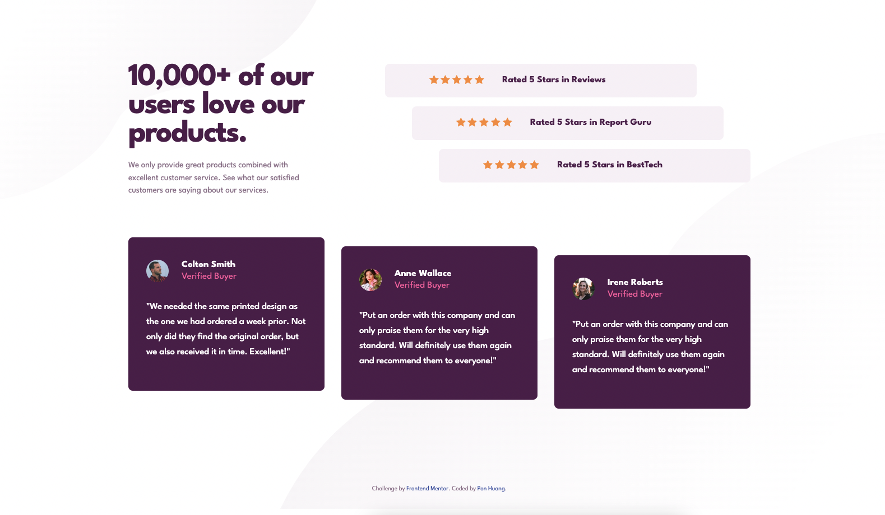
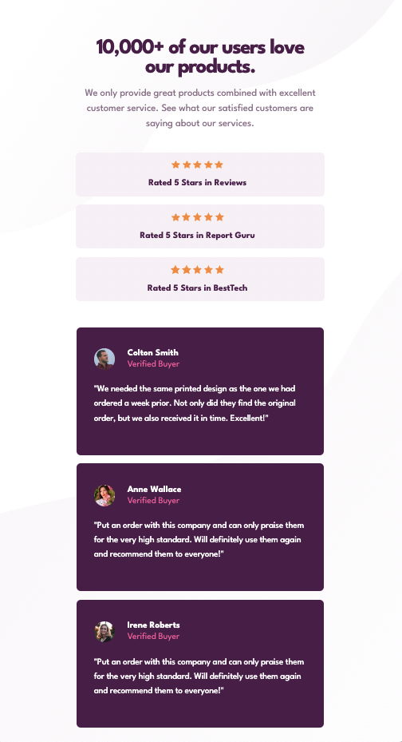

# Frontend Mentor - Social proof section solution

This is a solution to the [Social proof section challenge on Frontend Mentor](https://www.frontendmentor.io/challenges/social-proof-section-6e0qTv_bA). Frontend Mentor challenges help you improve your coding skills by building realistic projects.

## Table of contents

- [Overview](#overview)
  - [The challenge](#the-challenge)
  - [Screenshot](#screenshot)
  - [Links](#links)
- [My process](#my-process)
  - [Built with](#built-with)
- [Author](#author)

**Note: Delete this note and update the table of contents based on what sections you keep.**

## Overview

### The challenge

Users should be able to:

- View the optimal layout for the section depending on their device's screen size

### Screenshot

Desktop

Mobile

### Links

- [Solution URL](https://github.com/ponhuang/social-proof-section)
- [Live Site URL](https://ponhuang.github.io/social-proof-section/)

## My process

### Built with

- Semantic HTML5 markup
- npm sass install
- SCSS cutome design
- Flexbox
- Desktop-first workflow

## Author

Pon Huang

- Instagram - [Pon Huang](https://www.instagram.com/ponhuang/)
- Art Blog - [une felt](https://une722.wordpress.com)
